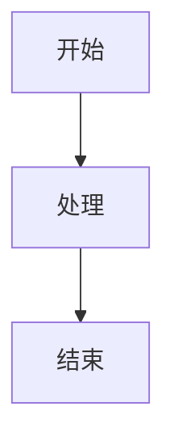

# Markdown 语法参考模板

> 用途：这是一份可长期复用的 Markdown 语法字典，覆盖常用标准语法和常见扩展语法。
>
> 说明：不同平台对 Markdown 的支持略有差异。本文默认以 CommonMark + GitHub Flavored Markdown (GFM) 为参考，并额外列出常见扩展语法。

---

## 1. 标题

### 写法

```md
# 一级标题
## 二级标题
### 三级标题
#### 四级标题
##### 五级标题
###### 六级标题
```

### 示例

# 一级标题
## 二级标题
### 三级标题
#### 四级标题
##### 五级标题
###### 六级标题

### 备注

- `#` 后建议加一个空格
- 一般一篇文档从一级标题开始，层级不要跳太乱

---

## 2. 段落与换行

### 写法

```md
这是第一段。

这是第二段。

这一行后面有两个空格  
所以这里会换行。
```

### 示例

这是第一段。

这是第二段。

这一行后面有两个空格  
所以这里会换行。

### 备注

- 空一行表示新段落
- 行尾两个空格可强制换行

---

## 3. 强调

### 写法

```md
*斜体*
_斜体_

**粗体**
__粗体__

***粗斜体***
___粗斜体___

~~删除线~~
```

### 示例

*斜体*
_斜体_

**粗体**
__粗体__

***粗斜体***
___粗斜体___

~~删除线~~

### 备注

- 推荐统一使用 `*` 和 `**`
- 删除线通常属于 GFM 扩展，但大多数平台都支持

---

## 4. 引用

### 写法

```md
> 这是一级引用
>
> 引用也可以分多段

>> 这是二级引用
```

### 示例

> 这是一级引用
>
> 引用也可以分多段

>> 这是二级引用

### 备注

- 常用于说明、提示、备注、警告

---

## 5. 无序列表

### 写法

```md
- 项目 A
- 项目 B
  - 子项目 B1
  - 子项目 B2

* 项目 C
+ 项目 D
```

### 示例

- 项目 A
- 项目 B
  - 子项目 B1
  - 子项目 B2

### 备注

- 常见符号有 `-`、`*`、`+`
- 推荐全文统一使用一种

---

## 6. 有序列表

### 写法

```md
1. 第一步
2. 第二步
3. 第三步

1. 第一项
1. 第二项
1. 第三项
```

### 示例

1. 第一步
2. 第二步
3. 第三步

### 备注

- 很多渲染器允许全部写成 `1.`，会自动编号
- 为了可读性，建议手写正确编号

---

## 7. 任务列表

### 写法

```md
- [x] 已完成事项
- [ ] 待完成事项
- [ ] 继续跟进事项
```

### 示例

- [x] 已完成事项
- [ ] 待完成事项
- [ ] 继续跟进事项

### 备注

- 这是 GFM 常见扩展
- 常用于 TODO、计划、检查单

---

## 8. 分隔线

### 写法

```md
---

***

___
```

### 示例

---

### 备注

- 推荐统一使用 `---`

---

## 9. 行内代码

### 写法

```md
请运行 `make test` 命令。
变量名可以写成 `data_valid`。
```

### 示例

请运行 `make test` 命令。
变量名可以写成 `data_valid`。

### 备注

- 适合命令、路径、变量名、函数名等短内容

---

## 10. 代码块

### 写法

````md
```python
def add(a, b):
    return a + b
```

```bash
make sim
./run.sh
```
````

### 示例

```python
def add(a, b):
    return a + b
```

```bash
make sim
./run.sh
```

### 备注

- 三个反引号围住代码块
- 开头可写语言名，启用语法高亮

---

## 11. 链接

### 行内链接写法

```md
[OpenAI](https://openai.com)
[项目主页](https://example.com/docs)
```

### 示例

[OpenAI](https://openai.com)

### 自动链接

```md
<https://example.com>
<user@example.com>
```

### 示例

<https://example.com>

### 参考式链接

```md
[搜索引擎][search]

[search]: https://www.google.com
```

### 示例

[搜索引擎][search]

[search]: https://www.google.com

### 备注

- 文档中链接较多时，参考式写法更整洁

---

## 12. 图片

### 写法

```md


```

### 示例

```md

```

### 备注

- 语法和链接类似，只是在前面加一个 `!`
- 有些平台支持 HTML 方式控制宽高

---

## 13. 表格

### 写法

```md
| 列 1 | 列 2 | 列 3 |
| --- | --- | --- |
| A1 | B1 | C1 |
| A2 | B2 | C2 |
```

### 对齐方式

```md
| 左对齐 | 居中 | 右对齐 |
| :--- | :---: | ---: |
| 文本 | 文本 | 文本 |
```

### 示例

| 左对齐 | 居中 | 右对齐 |
| :--- | :---: | ---: |
| 文本 | 文本 | 文本 |

### 备注

- 表格通常属于 GFM 常见扩展
- 表格里不适合放太复杂内容

---

## 14. 转义字符

### 写法

```md
\*不是斜体\*
\# 不是标题
\[不是链接\](https://example.com)
```

### 示例

\*不是斜体\*
\# 不是标题
\[不是链接\](https://example.com)

### 备注

- 用反斜杠 `\` 转义特殊符号

---

## 15. HTML 内嵌

### 写法

```md
<br>
<kbd>Ctrl</kbd> + <kbd>C</kbd>
<sub>下标</sub>
<sup>上标</sup>
```

### 示例

<br>
<kbd>Ctrl</kbd> + <kbd>C</kbd>
<sub>下标</sub>
<sup>上标</sup>

### 备注

- Markdown 不够用时，可适度插入 HTML
- 不同平台对 HTML 支持程度不同

---

## 16. 引用脚注

### 写法

```md
这里有一句话，需要脚注说明。[^1]

[^1]: 这是脚注内容。
```

### 示例

这里有一句话，需要脚注说明。[^1]

[^1]: 这是脚注内容。

### 备注

- 脚注不是所有平台都支持
- GitHub 现已支持，部分编辑器也支持

---

## 17. 锚点与目录

### 目录手写示例

```md
- [1. 标题](#1-标题)
- [2. 段落与换行](#2-段落与换行)
- [3. 强调](#3-强调)
```

### 备注

- 大多数平台会根据标题自动生成锚点
- 中文标题锚点规则可能因平台不同而有差异
- 如果平台支持，也可以直接使用自动目录插件或 `[TOC]`

---

## 18. 数学公式（扩展语法）

### 行内公式写法

```md
$E = mc^2$
```

### 块级公式写法

```md
$$
\sum_{i=1}^{n} i = \frac{n(n+1)}{2}
$$
```

### 示例

$E = mc^2$

$$
\sum_{i=1}^{n} i = \frac{n(n+1)}{2}
$$

### 备注

- 需要平台支持 KaTeX 或 MathJax
- 并非所有 Markdown 渲染器默认支持

---

## 19. Mermaid 图（扩展语法）

### 写法

````md

````

### 示例


### 备注

- 需要平台支持 Mermaid
- 常用于流程图、时序图、状态图

---

## 20. Emoji（扩展语法）

### 写法

```md
:smile:
:rocket:
:white_check_mark:
```

### 示例

:smile: :rocket: :white_check_mark:

### 备注

- 多数托管平台支持 emoji shortcode
- 本地渲染器不一定支持

---

## 21. 注释写法

### 写法

```md
<!-- 这是一段注释，不会显示在渲染结果中 -->
```

### 备注

- 适合写给维护者看的说明
- 最终页面通常不会显示

---

## 22. 常用文档模板片段

### 会议纪要模板

```md
# 会议纪要

## 会议主题

## 时间

## 参会人

## 讨论内容

1. 事项一
2. 事项二

## 结论

## 待办

- [ ] 待办 1
- [ ] 待办 2
```

### 项目 README 模板

````md
# 项目名称

## 简介

## 功能特性

- 特性 1
- 特性 2

## 安装方法

```bash
make install
```

## 使用方法

```bash
make run
```

## 目录结构

## 常见问题

## License
````

### 变更记录模板

```md
# Changelog

## [Unreleased]

### Added
- 新增功能

### Changed
- 变更内容

### Fixed
- 修复问题
```

---

## 23. 常见易错点

1. 标题符号 `#` 后忘记加空格
2. 列表上下没有空行，导致渲染异常
3. 代码块没有闭合
4. 表格分隔线写错
5. 中英文混排时空格风格不统一
6. 图片路径写成绝对本地路径，导致别人打不开
7. 误以为所有平台都支持脚注、数学公式、Mermaid

---

## 24. 速查总表

| 目标 | 语法 | 示例 |
| --- | --- | --- |
| 标题 | `# 标题` | `## 第二章` |
| 粗体 | `**文字**` | `**重点**` |
| 斜体 | `*文字*` | `*说明*` |
| 删除线 | `~~文字~~` | `~~废弃~~` |
| 引用 | `> 内容` | `> 注意事项` |
| 无序列表 | `- 项目` | `- 苹果` |
| 有序列表 | `1. 项目` | `1. 步骤一` |
| 任务列表 | `- [ ] 事项` | `- [x] 完成` |
| 行内代码 | `` `code` `` | `` `make test` `` |
| 代码块 | `````lang ... ````` | ` ```python ` |
| 链接 | `[文本](URL)` | `[官网](https://example.com)` |
| 图片 | `` | `` |
| 表格 | `| A | B |` | 见上文 |
| 脚注 | `[^1]` | `说明[^1]` |
| 数学公式 | `$...$` 或 `$$...$$` | `$a+b$` |
| 注释 | `<!-- 注释 -->` | `<!-- 内部备注 -->` |

---

## 25. 建议用法

如果你想把这份文档当作个人 Markdown 词典，建议这样用：

1. 写新文档时直接复制需要的语法片段
2. 把自己常用的模板补充到“常用文档模板片段”一节
3. 如果主要在 GitHub、GitLab、Typora、Obsidian 或 VS Code 中写 Markdown，可以再按平台补充“平台差异说明”

---

## 26. 平台差异补充区（可自行扩展）

```md
### GitHub
- 支持任务列表
- 支持表格
- 支持脚注
- 支持 Mermaid

### Typora
- 支持数学公式
- 支持目录
- 支持 Mermaid

### 某内部文档平台
- 支持：
- 不支持：
```

---

以上就是一份比较完整的 Markdown 语法参考模板。你可以直接把它当成速查手册使用。